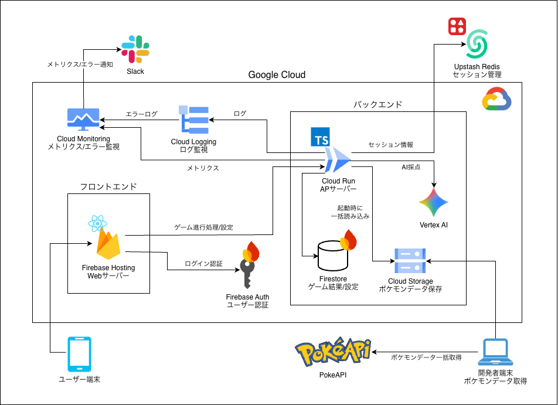
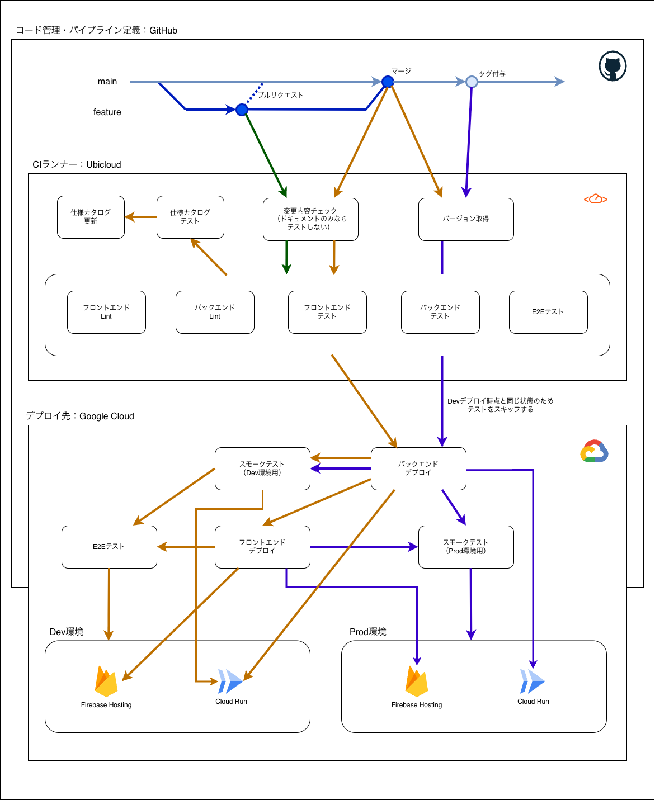

# PokeLingual

ポケモンの英語図鑑説明文を日本語に翻訳して、ポケモンを捕まえるゲーム。

英語の説明文が表示され、それを日本語に翻訳 → AI がスコアリング → ポケモンの名前を当てる → スコアに応じた確率で捕獲。翻訳の正確さとポケモン知識の両方が試される。

## 技術スタック

| レイヤー | 技術 |
|---------|------|
| フロントエンド | React, TypeScript, Vite, Tailwind CSS |
| バックエンド | Node.js, Express, TypeScript |
| データベース | Cloud Firestore |
| セッションストア | Upstash Redis（ローカルは Valkey） |
| 認証 | Firebase Authentication |
| AI スコアリング | Gemini（Vertex AI） |
| ポケモンデータ | PokeAPI |
| インフラ | Google Cloud（Cloud Run, Artifact Registry）, Terraform |
| CI/CD | GitHub Actions |
| テスト | Vitest, Testing Library, Playwright |

## ドキュメント

| ドキュメント | 内容 |
|---|---|
| [セットアップ](docs/setup.md) | ローカル開発環境の起動、別の Google Cloud プロジェクトでの構築手順 |
| [技術判断記録（ADR）](docs/adr/) | 各設計判断の背景・理由・結果 |
| [業務判断記録（BDR）](docs/bdr/) | 仕様・ゲームルールの背景・理由・結果 |
| [運用手順書](docs/ops/) | prod リリース・ロールバック・アラート対応と緊急停止・Firestore バックアップ復旧・コスト設計の手順 |
| [テスト観点カタログ](https://kenyamaneko.github.io/pokelingual/) | テスト名から自動生成したテスト済みの観点一覧。外から見た振る舞いと内部の挙動に分けて掲載（main の CI が更新） |
| [テストカバレッジ（backend）](https://kenyamaneko.github.io/pokelingual/coverage/backend/) | backend のテストカバレッジレポート（main の CI が更新） |
| [テストカバレッジ（frontend）](https://kenyamaneko.github.io/pokelingual/coverage/frontend/) | frontend のテストカバレッジレポート（main の CI が更新） |

## アーキテクチャ



## CI/CD



## ディレクトリ構成

```
├── backend/
│   ├── src/
│   │   ├── config/          # 環境変数の読み込み
│   │   ├── domain/          # ドメインロジック、インターフェース定義
│   │   ├── handler/         # HTTP ハンドラー
│   │   ├── middleware/      # 認証、レート制限
│   │   ├── adapter/         # Firestore・PokeAPI・Gemini 実装
│   │   ├── router/          # ルーティング定義
│   │   ├── service/         # ビジネスロジック（Quest, Pokedex）
│   │   └── util/            # ロガー等の共通ユーティリティ
│   └── Dockerfile
├── frontend/
│   ├── src/
│   │   ├── pages/           # ページコンポーネント
│   │   ├── components/      # 共通コンポーネント
│   │   ├── contexts/        # AuthContext, DevAuthContext
│   │   ├── hooks/           # カスタムフック
│   │   ├── api/             # バックエンド API クライアント
│   │   └── firebase.ts      # Firebase 設定
│   └── Dockerfile.dev
├── shared/api-types/        # backend↔frontend API 契約型 (SSoT)
├── terraform/               # Google Cloud インフラ（dev/prod）
├── scripts/                 # デプロイ後スモーク・テスト観点カタログ生成スクリプト
├── docs/                    # ドキュメント
├── docker-compose.dev.yml   # ローカル開発環境
└── Makefile
```

<!-- DRAFT: 最終稿は人間が編集する -->
## ライセンス & 法的事項

このアプリケーションは **非公式のファンメイドアプリ**であり、株式会社ポケモン・任天堂・ゲームフリーク等とは
一切関係ありません。

- ポケモン、Pokémon、ポケモンのキャラクター名・画像・図鑑説明文は、株式会社ポケモン・任天堂・ゲームフリーク等の
  商標または著作物です
- データソースとして [PokeAPI](https://pokeapi.co/) を利用しています。PokeAPI の
  [Fair Use Policy](https://pokeapi.co/docs/v2#fairuse) に準拠し、非商用・個人利用に限定します
- 本アプリは収益化を行いません
- 権利者からの申し立てがあった場合は、速やかにサービスを停止します
